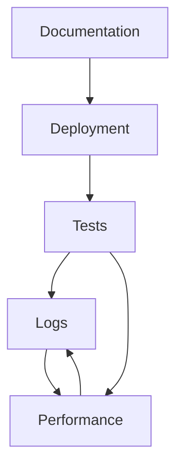

# 🏗️ Modules Architecture

Cấu trúc module được tổ chức để quản lý codebase một cách rõ ràng và hiệu quả.

## 📁 Module Structure

```
Modules/
├── 🧪 Tests/              # Test scripts và benchmark tools
├── 📚 Documentation/      # Tất cả tài liệu hướng dẫn
├── 📊 Performance/        # Performance analysis tools
├── 📋 Logs/              # Log files và performance data
└── 🚀 Deployment/        # Deployment packages và tools
```

## 🧪 Tests Module
**Mục đích**: Chứa tất cả test scripts, benchmark tools và validation utilities.

**Nội dung chính**:
- Multi-core performance tests
- UI performance validation
- OLEDB connection testing
- Quick benchmark tools
- Integration test suites

**Sử dụng**: Development và QA testing phases.

## 📚 Documentation Module
**Mục đích**: Tập trung tất cả documentation, guides và architectural documents.

**Nội dung chính**:
- Architecture documentation
- Performance optimization guides
- Deployment instructions
- System requirements
- API documentation

**Sử dụng**: Development reference, deployment guides, user manuals.

## 📊 Performance Module
**Mục đích**: Tools phân tích performance, monitoring và optimization.

**Nội dung chính**:
- Performance analysis scripts
- Benchmark comparison tools
- System impact analysis
- Performance monitoring utilities

**Sử dụng**: Performance optimization, monitoring và troubleshooting.

## 📋 Logs Module
**Mục đích**: Lưu trữ tất cả log files, performance data và diagnostic information.

**Nội dung chính**:
- Performance CSV logs
- Diagnostic session files
- Historical performance data
- Error logs và traces

**Sử dụng**: Performance analysis, debugging, historical tracking.

## 🚀 Deployment Module
**Mục đích**: Quản lý deployment packages, installation scripts và release artifacts.

**Nội dung chính**:
- Complete deployment packages
- Installation/uninstallation scripts
- Configuration templates
- Release archives

**Sử dụng**: Production deployment, distribution, installation.

## 🔄 Module Interactions



### Interaction Flows:
1. **Tests → Logs**: Test results và performance data
2. **Performance → Logs**: Analysis results và reports  
3. **Logs → Performance**: Historical data for analysis
4. **Documentation → Deployment**: Guides for deployment process
5. **Deployment → Tests**: Validation of deployed packages

## 🎯 Benefits của Module Architecture

### 1. **Separation of Concerns**
- Mỗi module có responsibility rõ ràng
- Dễ maintain và update
- Reduced coupling giữa components

### 2. **Improved Organization**
- Dễ tìm files và resources
- Clear structure cho team members
- Better version control management

### 3. **Scalability**
- Dễ thêm new modules
- Independent module development
- Flexible deployment options

### 4. **Maintenance**
- Isolated updates và fixes
- Clear dependency management
- Easier troubleshooting

## 🔧 Development Workflow

### 1. **Feature Development**
```bash
# Work in main codebase
# Write tests in Tests/ module
# Update documentation in Documentation/
```

### 2. **Performance Testing**
```bash
# Run performance analysis from Performance/
# Review logs in Logs/
# Update optimization guides
```

### 3. **Deployment**
```bash
# Package using Deployment/ tools
# Validate with Tests/ suite
# Document in Documentation/
```

## 📝 Module Maintenance

### Regular Tasks:
- **Weekly**: Review logs for performance trends
- **Monthly**: Update documentation với new features
- **Quarterly**: Clean old logs và archive
- **Release**: Update deployment packages

### Best Practices:
- Keep modules loosely coupled
- Document cross-module dependencies
- Regular cleanup of old files
- Consistent naming conventions
